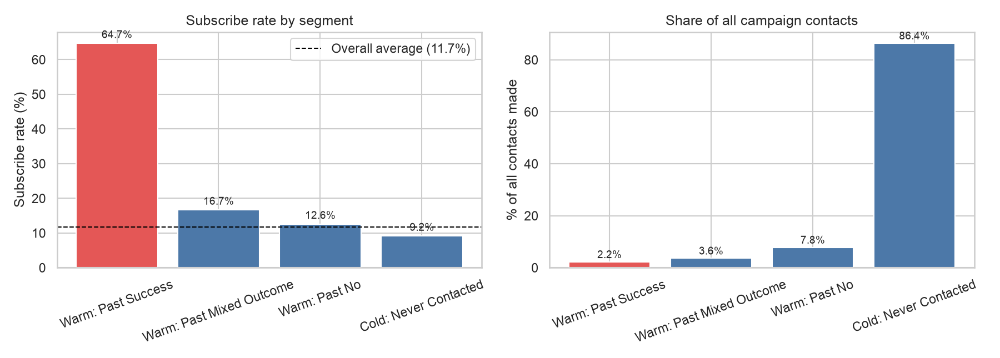
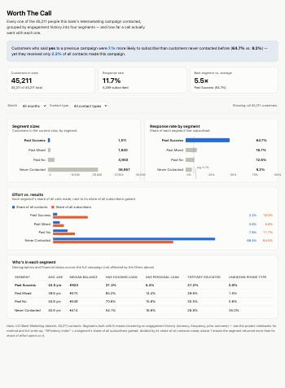

# Customer Segmentation & Marketing Campaign Analytics

**Which customers are worth calling, and does it matter when or how you reach them?**

I segmented 45,211 bank customers by their engagement history, using SQL for the data work and
K-means clustering for the segmentation, then measured how differently each segment actually
responded to a real telemarketing campaign.

**Motivation.** As a Consumer Account Manager at Postal Savings Bank of China I ran 14
consumer-finance marketing campaigns. This project asks the same question I had to answer by
judgment at the time — who is actually worth reaching out to — using data instead.

> **Scope note.** The data is the public [Bank Marketing](https://archive.ics.uci.edu/dataset/222/bank+marketing)
> dataset (UCI Machine Learning Repository), from a Portuguese bank's phone campaign selling term
> deposits. It does not represent any particular bank's customers, and the campaign spans multiple
> years without a year field in the file (see "Where this falls short" below).

---

## Headline result



| | Result |
|---|---|
| **Customers analyzed** | 45,211 |
| **Segments found** | 4, by K-means clustering on engagement history (silhouette score 0.767) |
| **Best segment's response rate** | **64.7%** ("Warm: Past Success") |
| Overall average | 11.7% |
| Worst segment ("Cold: Never Contacted", 82% of customers) | 9.2% |
| **Headline finding** | The best segment was **7.1x** more likely to subscribe than the worst, yet received only **2.2%** of all calls made |

## Try the dashboard

**[Worth The Call — live interactive dashboard](https://claude.ai/artifact/8NixYHvrTiJhYWaf2BjFmo)**



Filter by month or contact type and watch every chart and KPI update. See
[`dashboard/README.md`](dashboard/README.md) for what it shows and how it was built (not
Tableau — see that file for why).

## The four segments

Built from **engagement history alone** (recency, frequency, prior outcome) — demographics were
tested as clustering inputs too, but made the segments measurably worse, so they're used only to
describe each segment afterward, not to define it.

| Segment | Share of customers | Response rate | Efficiency index* | What makes them distinct |
|---|---|---|---|---|
| Warm: Past Success | 3.3% | 64.7% | 8.47 | Higher balance, less debt, most educated, best phone-number data |
| Warm: Past Mixed Outcome | 4.1% | 16.7% | 1.60 | Above average |
| Warm: Past No | 10.8% | 12.6% | 1.50 | Above average |
| Cold: Never Contacted | 81.7% | 9.2% | 0.74 | Below average, and 35% have no usable phone-type on file |

*Efficiency index = share of all subscribers gained ÷ share of all calling effort spent on that
segment. Above 1 means the segment returned more than its share of the effort put into it.

## What drives a good call: timing and channel

- **March, September, October and December convert 4-7x better than average** — and that holds
  inside every segment, not just in the aggregate.
- **A verified cellular number matters, especially for the 82% "Never Contacted" segment**: 12.0%
  convert on cellular vs. 4.0% on a number with no reliable type recorded.
- **A finding that reversed itself under scrutiny:** May and June looked like the worst months in
  the raw data. But 58% of May's calls and 85% of June's were on unreliable numbers, and those
  convert badly regardless of month. Restricted to verified cellular numbers, May is close to
  average and June converts nearly as well as the best months. The real lesson: verify the
  number, don't avoid the month.

## Where this falls short

- **One bank, one campaign, no control group.** Nothing here is a randomized experiment — "March
  converts better" describes what happened, not what would happen if more calls moved there.
- **The data spans multiple years with no year column.** Row order and UCI's own documentation
  indicate this campaign ran over roughly three years; checking this file directly confirms it —
  contacts labeled "may" are scattered across nearly the whole file, not one contiguous block,
  which is only possible across several different years. A "month" here averages conditions that
  may have differed a great deal from one year to the next.
- **`duration` (how long the call lasted) was deliberately excluded** from segmentation and
  analysis, since it's only known after a call happens and would leak the outcome. This likely
  understates what's technically predictable, on purpose.
- **No cost or profit data.** "Worth calling" here means "converts well for the effort," not a
  currency figure.

## How it was built

| Step | Notebook | What it does |
|---|---|---|
| 1. Data understanding | [01_data_understanding](notebooks/01_data_understanding.ipynb) | Profiles the data with real SQL files; decides how to treat the dataset's "unknown" categories; builds `bank_clean` |
| 2. SQL exploration | [02_sql_exploration](notebooks/02_sql_exploration.ipynb) | Subscription rate by job, education, month, contact type and prior outcome, each a standalone `.sql` file |
| 3. Customer segmentation | [03_customer_segmentation](notebooks/03_customer_segmentation.ipynb) | Engineers recency/frequency/prior-outcome features; K-means with the elbow method and silhouette score; tests and rejects a demographics-based alternative |
| 4. Segment × campaign performance | [04_segment_campaign_performance](notebooks/04_segment_campaign_performance.ipynb) | Joins segments to calling effort and results; the headline stat and the efficiency index |
| 5. Dashboard preparation | [05_dashboard_prep](notebooks/05_dashboard_prep.ipynb) | Exports the flat file the dashboard is built from |
| 6. Business interpretation | [06_business_interpretation](notebooks/06_business_interpretation.ipynb) | Segment, timing and channel recommendations, each checked against an alternative explanation before being stated |

All SQL lives in [`sql/`](sql/) as real, standalone `.sql` files — 15 of them, one query per file,
read and run from the notebooks rather than retyped into cells. Reusable database helpers are in
[`src/db.py`](src/db.py).

**Choices worth knowing about**
- K-means was tuned with both the elbow method and the silhouette score; they agreed on 4
  segments (silhouette 0.767). Adding demographics and financial status to the clustering was
  tested and made the segments measurably worse (best silhouette 0.459), so they were dropped from
  the clustering and kept only for describing the segments afterward.
- The "unknown" category in several columns (`job`, `education`, `contact`, `poutcome`) was kept
  as its own category rather than imputed — for `contact` and `poutcome` it turned out to be
  meaningful (mostly "first-time contact"), not a data gap.
- Every recommendation in Phase 6 was checked against a plausible confound before being stated;
  two of those checks changed the recommendation from what a first look at the data suggested.

## How to run it

**1. Get the data** (not included in this repo): see [`data/README.md`](data/README.md) — a
direct, no-login download from the UCI Machine Learning Repository.

**2. Set up Python** (3.11+, tested with 3.13):

```bash
python3 -m venv .venv
source .venv/bin/activate
pip install -r requirements.txt
python -m ipykernel install --user --name python3
```

**3. Run the notebooks in order** (1 to 6):

```bash
cd notebooks
for n in 01_data_understanding 02_sql_exploration 03_customer_segmentation \
         04_segment_campaign_performance 05_dashboard_prep 06_business_interpretation; do
  jupyter nbconvert --to notebook --execute --inplace $n.ipynb
done
```

Notebook 1 builds `bank_marketing.duckdb` (not committed; rebuilt from the CSV each run) — every
later notebook and every `.sql` file in `sql/` reads from that one shared database. Random seeds
are fixed, so results should reproduce.

**4. See the dashboard**: open [`dashboard/worth_the_call.html`](dashboard/worth_the_call.html)
directly in any browser — no server needed — or use the
[live link](https://claude.ai/artifact/8NixYHvrTiJhYWaf2BjFmo).

## Repository layout

```
customer-segmentation-marketing/
├── README.md
├── requirements.txt
├── data/          # data instructions (raw CSV not committed)
├── sql/           # 15 standalone .sql files, profiling through feature engineering
├── notebooks/     # the six analysis notebooks, in order
├── src/           # DuckDB helper module shared across notebooks
├── dashboard/     # the interactive dashboard, its data export, and its own README
└── reports/       # charts and the 1-page written summary
```

## Credits

Data: [Bank Marketing](https://archive.ics.uci.edu/dataset/222/bank+marketing), UCI Machine
Learning Repository (Moro, S., Rita, P., & Cortez, P., 2014). Built with DuckDB, pandas,
scikit-learn, matplotlib and seaborn.
